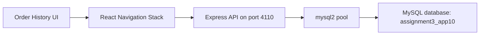
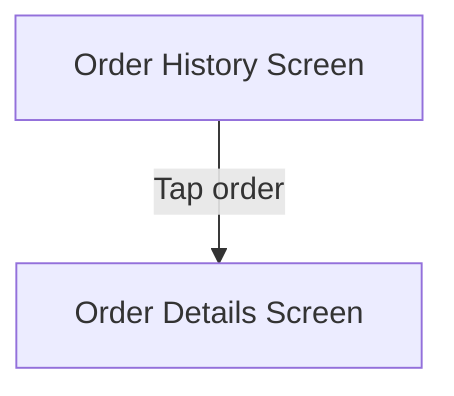

# Food Delivery Order History App

## Overview

This project is an order history module for a food delivery application. It retrieves completed orders from MySQL, presents them in a mobile list, and uses navigation to open an order details view with item summary information.

The implementation reflects a common real-world pattern: historical data list on the first screen, then a details surface for contextual inspection.

## Architecture



## Key Features

- Fetches historical order data from a dedicated database
- Displays order number, date, and total amount
- Navigates to a detail screen for item summary review
- Uses isolated backend and database configuration
- Provides a compact but realistic food-order history flow

## Technology Stack

- React Native with Expo SDK 54
- React Navigation
- Express.js
- mysql2
- MySQL via XAMPP

## API Contract

### `GET /orders`

Returns:

```json
[
  {
    "id": 1,
    "order_code": "FD-1001",
    "order_date": "2026-04-01",
    "total_price": "22.50",
    "items_summary": "1 Zinger burger, 1 fries, 1 drink"
  }
]
```

## Database Design

Database: `assignment3_app10`

Table: `orders`

| Column | Type |
|---|---|
| id | INT, PK, AUTO_INCREMENT |
| order_code | VARCHAR(30) |
| order_date | DATE |
| total_price | DECIMAL(10,2) |
| items_summary | TEXT |

## Navigation Flow



## Project Structure

```text
.
├── App.js
├── AppMain.js
├── server.js
├── sql2.sql
├── package.json
└── .gitignore
```

## Run Locally

1. Start MySQL in XAMPP.
2. Import [`sql2.sql`](./sql2.sql).
3. Run `npm install`
4. Run `node server.js`
5. Run `npx expo start -c`

Backend port: `4110`

## Engineering Notes

- This app demonstrates strong separation between list and detail responsibilities in a mobile workflow.
- It also highlights backend-to-navigation integration, which is a common production pattern.
